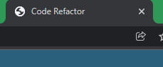

# homework_week_1

## Purpose

A Single Page Code Refactor website.

## Built With

- HTML
- CSS

## Website

https://veeditparikh2211.github.io/homework_week_1/

## Steps for Code Refactor

1. Adding the Title to the page. 
</img>

2. Inserting the header tag.
</img>

3. Adding the nav tag with navigation class.
</img>

4. Adding the main tag for the class content and benefits.
</img>

5. Adding the class content-info to all 3 ids to get to one css.

6. Inserting the alt value to the all the image tag.
</img>

7. Adding the benefits class under the main tag.

8. Inserting the alt value under the benefit class.

9. Inserting the footer tag.
</img>

10. Adding the span tag for creating the heart emoji with in the footer tag.
11. Adding comments to index.html and style.css.
</img>

## Contribution

Made by Veedit Parikh
